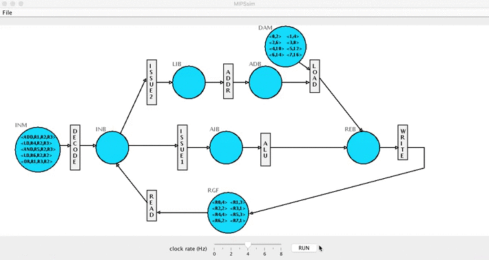

# Petri Net Simulator for a simplified MIPS Processor
Generates step-by-step simulation of the Petri net model of a simplified MIPS processor. 

 
 
 
# Compiling the Program:
To compile the source code into Java bytecode the JVM can interpret and run, invoke the Java compiler at the command line:
```javascript
   git clone https://github.com/thomas1242/MIPSsim && cd src
   javac MIPSsim.java 
```

# Interpreting and Running the Program:
To interpret and run the compiled Java program, invoke the Java interpreter at the command line to convert the Java bytecode to platform-dependent machine code your computer can understand and run. </br> </br>
<!---You'll need to supply 3 input files: instructions.txt with the MIPS instructons to be executed, registers.txt with 8 register tokens to initialize the registers, and datamemory.txt with 8 data tokens to initialize the data memory locations.--->

```javascript
   java MIPSsim
```
   <!---java MIPSsim instructions.txt registers.txt datamemory.txt --->
 
# Simplified MIPS Processor specification
###Instruction Memory (INM):
The simulated processor supports only five types of instructions:</br> 
add (ADD), subtract (SUB), logical and (AND), logical or (OR), and load (LD).</br> It supports the following instruction format:</br>
 < opcode >, < Destination Register >, < First Source Operand >, < Second Source Operand ></br>
 Sample instruction tokens and equivalent functionality are shown below:</br>
< ADD, R1, R2, R3> -> R1 = R2 + R3</br>
< SUB, R1, R2, R3> -> R1 = R2 – R3</br>
< AND, R1, R2, R3> -> R1 = R2 & R3</br>
< OR, R1, R2, R3>   -> R1 = R2 | R3</br>
< LD, R1, R2, R3>   -> R1 = DataMemory[R2+R3]</br>
###Register File (RGF):
This MIPS processor supports up to 8 registers (R0 through R7). At a time step it can have up to 8 tokens.
###Data Memory (DAM):
This MIPS processor supports up to 8 locations (0 – 7) in the data memory. At a time step it can have up to 8 tokens.
###READ:
The READ knows the top (in-order) instruction in the Instruction Memory (INM). It checks for the availability of the source operands in the Register File (RGF) for the top
instruction token and passes them to Instruction Buffer (INB) by replacing the source operands with the respective values. Both READ and DECODE transitions are
executed together.
###DECODE:
The DECODE transition consumes the top (in-order) instruction (one token) from INM and updates the
values of the source registers with the values from RGF (with the help of READ transition), and places the modified instruction token in INB.
###ISSUE1:
ISSUE1 transition consumes one arithmetic/logical (ADD, SUB, AND, OR) instruction token (if any) from INB and places it in the Arithmetic Instruction Buffer (AIB).
###ISSUE2:
ISSUE2 transition consumes one load (LD) instruction token (if any) from INB and places it in the Load Instruction Buffer (LIB).
###Arithmetic Logic Unit (ALU):
ALU transition performs arithmetic/logical computations as per the instruction token from AIB, and
places the result in the result buffer (REB).
###Address Calculation (ADDR):
ADDR transition performs effective (data memory) address calculation for the load instruction by adding the contents of two source registers. It produces a token and places it in the address buffer (ADB).
###LOAD:
The LOAD transition consumes a token from ADB and gets the data from the data memory for the corresponding address. It places the data value (result of load) in the result buffer (REB).
###WRITE:
Transfers the result (one token) from the Result Buffer (REB) to the register file (RGF). If there are more than one token in REB in a time step, the WRITE transition writes the token that belongs to the in-order
first instruction.
